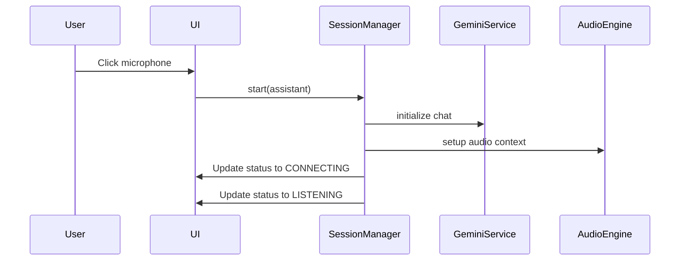
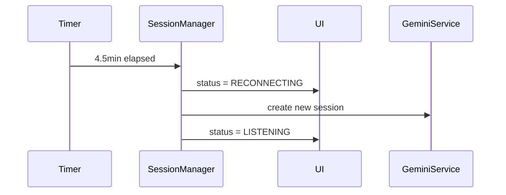
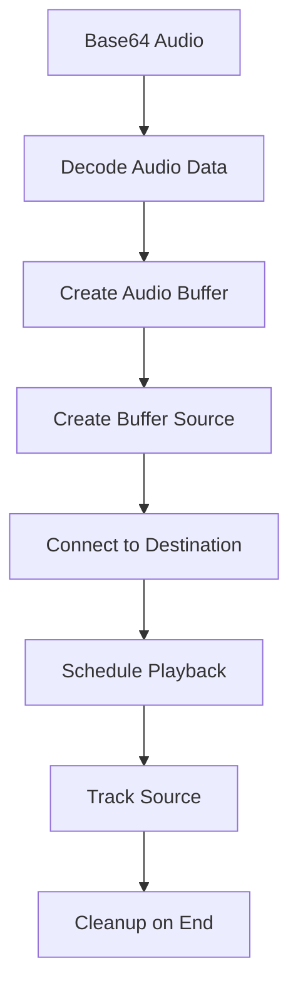
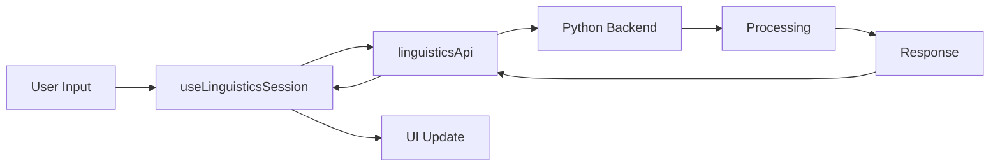
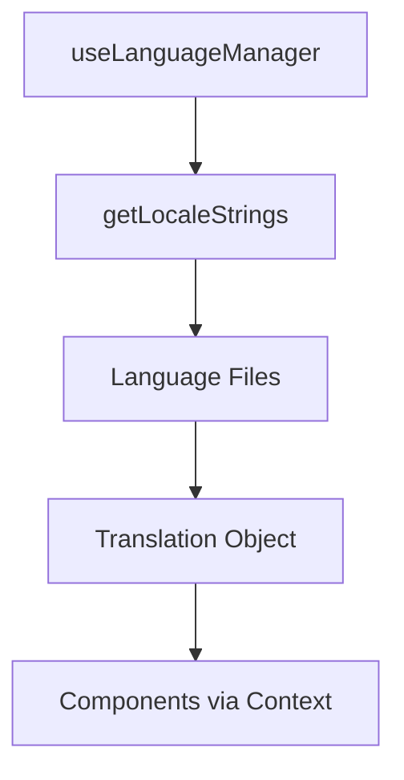

# VoiceApp Architecture Documentation

## Overview

The VoiceApp has been refactored from a monolithic structure to a modular, component-based architecture with clear separation of concerns. This document provides detailed information about the architecture, data flow, and design decisions.

## Core Architecture Principles

1. **Separation of Concerns**: UI, business logic, and state management are clearly separated
2. **Component Composition**: Small, focused components that compose together
3. **Hook-Based Logic**: Custom hooks encapsulate reusable stateful logic
4. **Service Layer**: Business logic abstracted into service classes
5. **Context-Driven State**: Global state managed through React Context
6. **Testability**: All components and services are easily testable

## Directory Structure

```
src/
├── components/VoiceApp/           # UI Components Layer
├── hooks/                       # Logic Layer (Custom Hooks)
├── services/                    # Service Layer (Business Logic)
├── types/                       # Type Definitions
├── i18n/                       # Internationalization
├── App.tsx                      # Entry Point
└── main.tsx                     # Bootstrap
```

## Component Architecture

### VoiceApp (Root Component)
- **Purpose**: Main container and provider wrapper
- **Responsibilities**:
  - Initialize VoiceAppProvider with API keys
  - Provide global context to entire app
  - Handle error boundaries

### MainLayout
- **Purpose**: Overall layout structure
- **Responsibilities**:
  - Arrange main layout sections
  - Handle responsive design
  - Render error banners
  - Coordinate mobile/desktop layouts

### SidePanel
- **Purpose**: Left sidebar with settings and persona management
- **Responsibilities**:
  - Toggle visibility on mobile
  - Coordinate persona and settings components
  - Handle responsive behavior

### TranscriptPanel
- **Purpose**: Display conversation history
- **Responsibilities**:
  - Render transcript messages
  - Handle pagination/load more
  - Show empty states
  - Display progress cards for linguistics

### ControlBar
- **Purpose**: Bottom control area
- **Responsibilities**:
  - Render chat input
  - Handle microphone controls
  - Display status indicators
  - Show log panel

## Hook Architecture

### useSessionManager (Coordinator Hook)
- **Purpose**: Central session coordination
- **Integrates**:
  - useLiveSession (core session logic)
  - useTranscript (conversation management)
  - useAudioEngine (audio handling)
  - useLogger (logging)
  - useLinguisticsSession (specialized sessions)
  - useLanguageManager (localization)
  - useAutoReconnectTimer (session management)

### Data Flow Pattern
```
User Action → UI Component → Hook → Service → API/Storage
                ↓
            Context Update → Re-render Components
```

## Service Layer Architecture

### GeminiService
- **Purpose**: Google Gemini API integration
- **Methods**:
  - `generateText(prompt, history)`: Generate text responses
  - `generateSpeech(text, voice)`: Generate TTS audio
- **Error Handling**: Comprehensive error catching and logging
- **State Management**: Stateless, relies on hook layer

### TranscriptService
- **Purpose**: Transcript persistence and export
- **Methods**:
  - `loadTranscript()`: Load from localStorage
  - `saveTranscript(transcript)`: Save to localStorage
  - `exportToText(transcript)`: Format as plain text
  - `exportToPdf(transcript)`: Generate PDF
  - `exportToJson(transcript)`: Format as JSON
  - `copyToClipboard(text)`: Copy to clipboard
- **Storage**: localStorage with error handling
- **Export**: Multiple formats (text, PDF, JSON)

### PersonaService
- **Purpose**: Persona management and persistence
- **Methods**:
  - `getAllAssistants()`: Get all personas (presets + custom)
  - `getAssistantById(id)`: Find specific persona
  - `addCustomAssistant(data)`: Add new custom persona
  - `updateCustomAssistant(id, updates)`: Update existing
  - `deleteCustomAssistant(id)`: Remove persona
- **Storage**: localStorage for custom personas
- **Presets**: Built-in persona definitions

## Context Architecture

### VoiceAppContext
- **Purpose**: Global state management
- **Structure**:
  ```typescript
  {
    session: SessionManager,
    transcript: TranscriptManager,
    audio: AudioManager,
    language: LanguageManager,
    logger: Logger,
    ui: UIState
  }
  ```

### State Distribution Strategy
- **Session State**: Live session, status, assistant selection
- **Transcript State**: Conversation history, display settings
- **Audio State**: Playback state, audio context
- **Language State**: Current locale, translation strings
- **Logger State**: Log messages, filtering
- **UI State**: Modal visibility, form inputs, temporary state

## Session Manager Flow

### Session Initialization


### Auto-Reconnect Logic


## Audio Engine Lifecycle

### Audio Context Management
- **Initialization**: Create AudioContext on first audio playback
- **Sample Rate**: Fixed at 24kHz for compatibility
- **Source Management**: Track all active audio sources
- **Cleanup**: Automatic source cleanup on playback end

### Playback Flow


## Linguistics Integration

### Service Communication
- **Protocol**: HTTP/REST API
- **Authentication**: API key based
- **Error Handling**: Retry logic with exponential backoff
- **State Management**: Dedicated hook for linguistics state

### Data Flow


## Internationalization Architecture

### Language Management
- **Supported Languages**: English (en), Russian (ru)
- **Storage**: localStorage with 'language' key
- **Fallback**: Browser language detection
- **Translation Keys**: Hierarchical key structure

### Translation Flow


## Error Handling Strategy

### Hook Layer
- **Try-Catch Wrappers**: All async operations wrapped
- **Error State**: Dedicated error state in context
- **User Feedback**: Status indicators and toast messages
- **Logging**: Comprehensive error logging

### Service Layer
- **API Errors**: Standardized error objects
- **Network Issues**: Retry logic with backoff
- **Storage Errors**: Graceful degradation
- **Validation**: Input validation before API calls

### Component Layer
- **Error Boundaries**: Catch React rendering errors
- **Loading States**: Show loading during async operations
- **Empty States**: Handle no data scenarios
- **Accessibility**: Error announcements for screen readers

## Performance Optimizations

### React Optimizations
- **React.memo**: Pure components for expensive renders
- **useMemo**: Cache expensive calculations
- **useCallback**: Stable function references
- **Context Splitting**: Separate contexts to prevent unnecessary re-renders

### Audio Optimizations
- **Audio Context Reuse**: Single context instance
- **Source Pooling**: Reuse audio sources when possible
- **Preloading**: Preload common audio responses
- **Memory Management**: Cleanup audio resources

### Storage Optimizations
- **Debounced Saves**: Prevent excessive localStorage writes
- **Data Compression**: Compress large datasets
- **Lazy Loading**: Load data on demand
- **Cache Strategies**: In-memory caching for frequently accessed data

## Testing Architecture

### Test Structure
- **Unit Tests**: Individual hook and service testing
- **Integration Tests**: Component integration testing
- **Service Tests**: API integration with mocks
- **Context Tests**: State management testing

### Mock Strategy
- **localStorage**: Mock implementation for tests
- **API Calls**: Jest mocks for external services
- **Audio Context**: Mock AudioContext for browser APIs
- **Timer Functions**: Mock timers for deterministic tests

### Coverage Targets
- **Hooks**: ≥90% coverage
- **Services**: ≥85% coverage
- **Components**: ≥80% coverage
- **Critical Paths**: 100% coverage

## Development Workflow

### Component Development
1. Create component in appropriate folder
2. Define props interface
3. Implement with context hooks
4. Add unit tests
5. Add integration tests
6. Update documentation

### Hook Development
1. Define hook interface and return type
2. Implement hook with error handling
3. Add comprehensive unit tests
4. Add to context if needed
5. Update documentation

### Service Development
1. Define service interface
2. Implement with error handling
3. Add service tests with mocks
4. Integrate with hooks
5. Update documentation

## Migration Guide

### From Monolithic App.tsx
The new architecture maintains all existing functionality while improving:

1. **Maintainability**: Clear separation of concerns
2. **Testability**: Isolated, testable units
3. **Reusability**: Modular components and hooks
4. **Performance**: Optimized re-rendering
5. **Developer Experience**: Better debugging and profiling

### Breaking Changes
- **None**: All existing functionality preserved
- **API Compatibility**: Same external interface
- **Data Migration**: Automatic localStorage migration
- **Feature Parity**: Complete feature preservation

This architecture provides a solid foundation for future enhancements while maintaining the stability and functionality of the existing application.