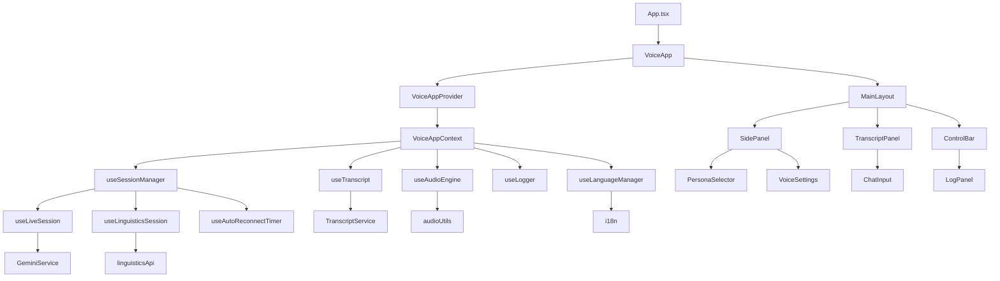

<div align="center">

</div>

# AI Voice Assistant with Linguistics Module

This contains everything you need to run your AI voice assistant app locally, including an advanced linguistics module for enhanced language processing.

View your app in AI Studio: https://ai.studio.apps/drive/1D-Qm7HvyN7TzaJFIo4322UF9HfmmMwsN

## New Architecture Overview

The application has been refactored into a modular, component-based architecture with clear separation of concerns:

```
src/
├── components/VoiceApp/           # Main UI components
│   ├── VoiceApp.tsx              # Main container component
│   ├── MainLayout.tsx            # Overall layout wrapper
│   ├── SidePanel.tsx             # Left panel (settings, persona list)
│   ├── TranscriptPanel.tsx        # Conversation history display
│   ├── ChatInput.tsx             # Text input + send button
│   ├── ControlBar.tsx            # Start/stop record, settings, logs toggle
│   ├── ProgressCards.tsx          # Status indicators, linguistics progress
│   ├── ModalsContainer.tsx       # Settings/persona info/export/logs modals
│   ├── PersonaManager/            # Persona-related components
│   ├── Settings/                 # Settings-related components
│   ├── Common/                   # Shared UI components
│   └── VoiceAppContext.tsx       # Global state management
├── hooks/                       # Custom React hooks
│   ├── useSessionManager.ts       # Session management
│   ├── useLanguageManager.ts     # Language management
│   ├── useTranscript.ts         # Transcript management
│   ├── useLogger.ts             # Logging functionality
│   ├── useAudioEngine.ts         # Audio playback
│   ├── useLiveSession.ts        # Live session handling
│   ├── useLinguisticsSession.ts # Linguistics service integration
│   └── useAutoReconnectTimer.ts # Auto-reconnect functionality
├── services/                    # Business logic services
│   ├── geminiService.ts         # Gemini API integration
│   ├── transcriptService.ts     # Transcript persistence
│   ├── personaService.ts        # Persona management
│   ├── audioUtils.ts           # Audio utilities
│   └── linguisticsApi.ts       # Linguistics API client
├── types/                       # TypeScript type definitions
├── i18n/                       # Internationalization
├── App.tsx                      # Slim entry point wrapper
└── main.tsx                     # Application bootstrap
```

## Hook Responsibilities

### useSessionManager
- Coordinates all session-related functionality
- Manages session state and lifecycle
- Integrates with other hooks for complete session management
- Handles auto-reconnect logic

### useLanguageManager  
- Manages application language (EN/RU)
- Provides translation strings
- Handles language persistence

### useTranscript
- Manages conversation history
- Handles transcript display and pagination
- Provides export functionality (copy/PDF)
- Manages transcript persistence

### useLogger
- Centralized logging functionality
- Handles log filtering and display
- Provides different log levels

### useAudioEngine
- Manages audio playback
- Handles TTS integration
- Manages audio context and sources

### useLiveSession
- Handles live voice sessions with Gemini
- Manages WebSocket-like streaming
- Handles session state transitions

### useLinguisticsSession
- Integrates with linguistics Python backend
- Handles linguistics-specific functionality
- Manages linguistics service state

### useAutoReconnectTimer
- Manages session timeout detection
- Handles automatic session refresh
- Prevents 4.5-minute timeout issues

## Service Architecture

### GeminiService
- Wraps Google Gemini API
- Handles text generation and TTS
- Manages chat sessions and history

### TranscriptService
- Handles transcript persistence to localStorage
- Provides export functionality
- Manages transcript formatting

### PersonaService  
- Manages preset and custom personas
- Handles persona CRUD operations
- Provides persona selection logic

## Testing Strategy

The application uses Vitest for testing with comprehensive coverage:

### Running Tests
```bash
# Run all tests
npm run test

# Run tests with UI
npm run test:ui

# Generate coverage report
npm run test:coverage
```

### Test Structure
- Unit tests for all hooks (`tests/*.test.ts`)
- Integration tests for components (`tests/*.test.tsx`)
- Service tests for API integrations (`tests/*Service.test.ts`)
- Context tests for state management (`tests/VoiceAppContext.test.tsx`)

### Coverage Targets
- ≥80% coverage for all new modules
- Critical path coverage (session management, audio, transcript)
- Error handling and edge case testing

## Configuration

### Environment Variables
- `GEMINI_API_KEY`: Gemini API key (required)
- `VITE_LINGUISTICS_URL`: Linguistics service URL (optional)

### localStorage Keys
- `transcript`: Conversation history
- `assistants`: Custom personas
- `selectedAssistantId`: Currently selected persona
- `customApiKey`: User's API key
- `language`: Application language (en/ru)
- `selectedVoice`: Voice selection
- `speakingRate`: TTS speech rate
- `pitch`: TTS pitch adjustment
- `isDevMode`: Developer mode toggle

## Run Locally

**Prerequisites:** Node.js, Python 3.8+

### Frontend (React App)

1. Install Node.js dependencies:
   ```bash
   npm install
   ```

2. Set `GEMINI_API_KEY` in [.env.local](.env.local) to your Gemini API key

3. Run frontend:
   ```bash
   npm run dev
   ```

### Linguistics Module (Python Backend)

The linguistics module provides advanced language processing, RAG capabilities, memory management, and voice processing.

1. Install Python dependencies:
   ```bash
   make install
   ```

2. Set up environment variables (create `.env.local` if not exists):
   ```env
   GEMINI_API_KEY=your_gemini_api_key_here
   ```

3. Create necessary directories:
   ```bash
   make setup-dirs
   ```

4. Run linguistics service:
   ```bash
   make linguistics-run
   ```

### Development Commands

- `make linguistics-test` - Run linguistics module tests
- `make lint` - Run Python linting checks
- `make format` - Format Python code
- `make validate-linguistics` - Validate package compilation
- `npm run test` - Run frontend tests
- `npm run test:coverage` - Generate test coverage report
- `npm run build` - Build for production

## Documentation

- [Linguistics Module Overview](docs/linguistics-overview.md) - Detailed setup and architecture guide
- [Data Directory](data/README.md) - Data structure and usage
- [HOSTING_GUIDE.md](HOSTING_GUIDE.md) - Deployment instructions
- [TTS_FALLBACK_GUIDE.md](TTS_FALLBACK_GUIDE.md) - Text-to-speech troubleshooting

## Architecture Diagram



## Extending the Application

### Adding New Personas
1. Add to `PersonaService.presetAssistants`
2. Add translation keys to `i18n/`
3. Test persona functionality

### Adding New Languages
1. Add language strings to `i18n/`
2. Update `SupportedLocale` type
3. Test language switching

### Adding New Services
1. Create service class in `src/services/`
2. Create corresponding hook in `src/hooks/`
3. Add to `useSessionManager` coordination
4. Write comprehensive tests

## Performance Optimizations

- React.memo for presentation components
- useMemo for expensive computations  
- useCallback for event handlers
- Optimized re-rendering through context structure
- Audio context management for performance

## Migration Guide

If migrating from the old monolithic App.tsx:

1. All state management is now in VoiceAppContext
2. UI components are modular and reusable
3. Services handle business logic separately
4. Hooks provide clean interfaces to services
5. Testing is comprehensive and isolated

The new architecture maintains all existing functionality while providing better maintainability, testability, and extensibility.